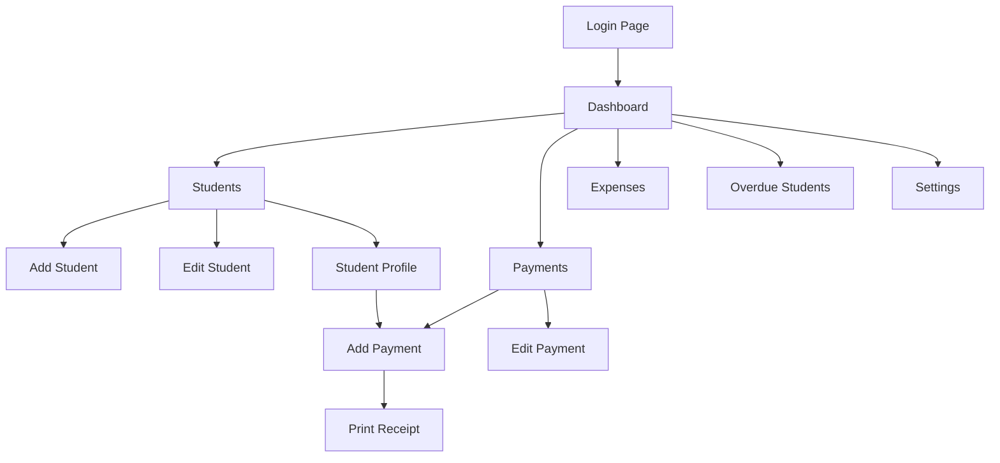
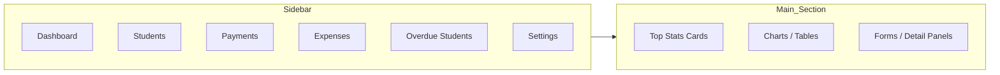

# Specification-sheet-detailing-features# EduManager Specification Sheet

## 1. Project Overview

EduManager is a PHP/MySQL student payment management system designed for small educational institutions such as schools, tuition centers, and academies. It provides student registration, tuition payment tracking, expense recording, overdue monitoring, financial reporting, and receipt generation in PDF format.

---

## 2. Functional Requirements

### 2.1 Authentication

- Secure login screen for administrator access.
- Session protection for all dashboard pages.
- Logout function to securely end sessions.

### 2.2 Dashboard

- Summary of monthly revenue, expenses, and net income.
- Charts for revenue trend, payment status, and payment method breakdown.
- Quick access to core sections: Students, Payments, Expenses, Overdue, Settings.

### 2.3 Student Management

- Add new student profiles with required information.
- Edit existing student details.
- List all students with quick actions.
- View student profile with payment history and overdue information.
- Option to delete a student record.

### 2.4 Payment Management

- Add new payments for students.
- Store amount, payment date, next due date, payment method, and receipt number.
- Edit payment records.
- List all payments with receipt number and status.
- Print PDF receipt for any payment.

### 2.5 Expense Tracking

- Add expense entries with category, amount, description, and date.
- Delete expense records.
- Display filtered expense list for the current month.
- Show total expenses.

### 2.6 Overdue Students

- Detect students with overdue payments.
- Display overdue students in a dedicated page.
- Include overdue status details and contact information.

### 2.7 User Settings

- Update administrator username.
- Change password with current password verification.
- Enforce basic password validation.

### 2.8 PDF Receipts

- Generate a payment receipt in PDF format using DOMPDF.
- Include transaction details and student information.

### 2.9 Security and Validation

- Use PDO prepared statements for database access.
- Form input sanitization and validation.
- Login guard on protected pages.
- CSRF token protection on actions where applicable.

---

## 3. Directory Structure

```
Project-final-Solicode-edumanager/
├── actions/
│   ├── add_payment.php
│   ├── add_student.php
│   ├── auth_login.php
│   ├── clear_all_students.php
│   ├── delete_payment.php
│   ├── delete_student.php
│   ├── logout.php
│   ├── print_receipt.php
│   ├── update_payment.php
│   ├── update_profile.php
│   └── update_student.php
├── assets/
│   ├── css/
│   │   └── style.css
│   └── js/
│       ├── dashboard_charts.js
│       ├── loader.js
│       ├── script.js
│       └── sidebar.js
├── config/
│   └── database.php
├── includes/
│   ├── auth_check.php
│   ├── dashboard_helpers.php
│   ├── finance_functions.php
│   ├── flash_messages.php
│   ├── footer.php
│   ├── functions.php
│   ├── header.php
│   └── sidebar.php
├── pages/
│   ├── add_payment.php
│   ├── add_student.php
│   ├── class_students.php
│   ├── classes.php
│   ├── dashboard.php
│   ├── edit_payment.php
│   ├── edit_student.php
│   ├── expenses.php
│   ├── login.php
│   ├── overdue_students.php
│   ├── payments.php
│   ├── settings.php
│   ├── student_profile.php
│   └── students.php
├── vendor/
│   └── ... (Composer dependencies including dompdf)
├── composer.json
├── README.md
└── student_payment_system.sql
```

---

## 4. Database Schema (BDD)

### 4.1 Database: `student_payment_system`

#### Table `students`

- `id` INT AUTO_INCREMENT PRIMARY KEY
- `full_name` VARCHAR(100) NOT NULL
- `phone` VARCHAR(20) NOT NULL
- `email` VARCHAR(100)
- `grade` VARCHAR(50)
- `classroom` VARCHAR(50)
- `monthly_fee` DECIMAL(10,2) NOT NULL
- `billing_day` INT DEFAULT 1
- `status` VARCHAR(20) DEFAULT 'active'
- `registration_date` DATE NOT NULL

#### Table `payments`

- `id` INT AUTO_INCREMENT PRIMARY KEY
- `student_id` INT NOT NULL
- `amount` DECIMAL(10,2) NOT NULL
- `payment_date` DATE NOT NULL
- `next_due_date` DATE NOT NULL
- `payment_method` VARCHAR(20) DEFAULT 'cash'
- `receipt_number` VARCHAR(50) UNIQUE NOT NULL
- Foreign key: `student_id` REFERENCES `students(id)`

#### Table `expenses`

- `id` INT AUTO_INCREMENT PRIMARY KEY
- `category` VARCHAR(100) NOT NULL
- `amount` DECIMAL(10,2) NOT NULL
- `description` TEXT
- `expense_date` DATE NOT NULL

#### Table `users`

- `id` INT AUTO_INCREMENT PRIMARY KEY
- `username` VARCHAR(50) UNIQUE NOT NULL
- `password` VARCHAR(255) NOT NULL

---

## 5. Wireframe

### 5.1 Main User Flow



### 5.2 Screen Layout Concept



### 5.3 Page Content Summary

- `login.php`: login form, error messages.
- `dashboard.php`: statistics cards, revenue/expense charts.
- `students.php`: list students, add/edit/delete actions.
- `student_profile.php`: detailed student info and payment history.
- `payments.php`: list payments, print receipt.
- `add_payment.php`: payment form.
- `expenses.php`: add expense form and expense list.
- `overdue_students.php`: overdue student list.
- `settings.php`: update admin username and password.

---

## 6. Implementation Notes

- The application uses `config/database.php` to connect with PDO.
- DOMPDF is used in `actions/print_receipt.php` to render receipt PDFs.
- Helper files under `includes/` manage authentication, messages, and finance calculations.
- `student_payment_system.sql` defines the full database schema and seeds an initial admin user.

---

## 7. Deployment Constraints

- Required runtime: PHP 8+.
- Database: MySQL / MariaDB.
- Local server: XAMPP, WAMP, or similar.
- Required composer dependencies installed in `vendor/`.
- Update `config/database.php` with the actual database name, username, and password before use.

---

## 8. Notes for Translation and Delivery

This document is written in English and includes both the application structure and the database schema. The wireframe uses Mermaid diagrams and can be rendered by a Markdown viewer that supports Mermaid syntax.
